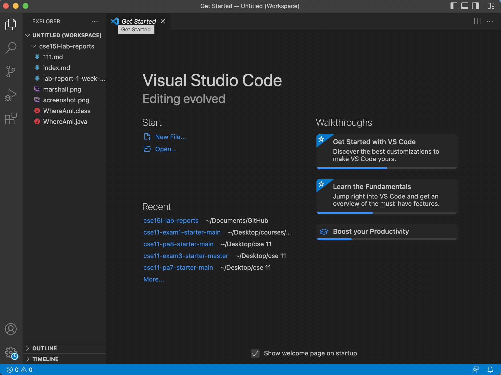
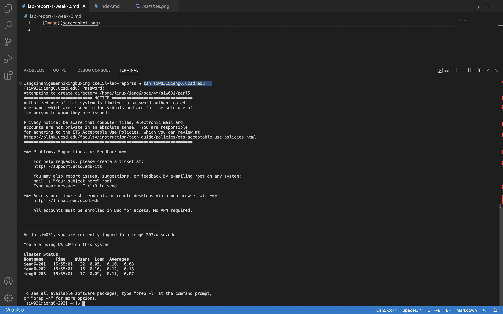
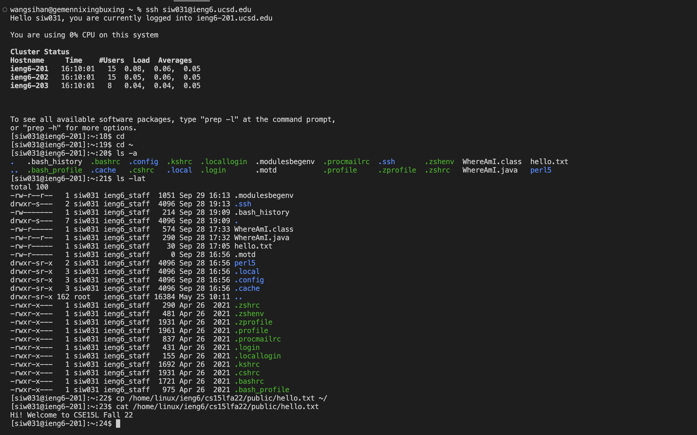
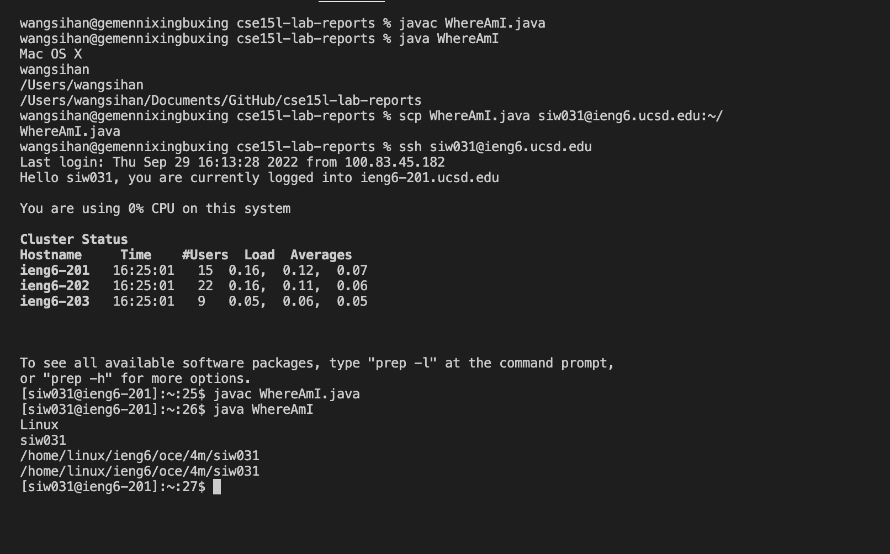
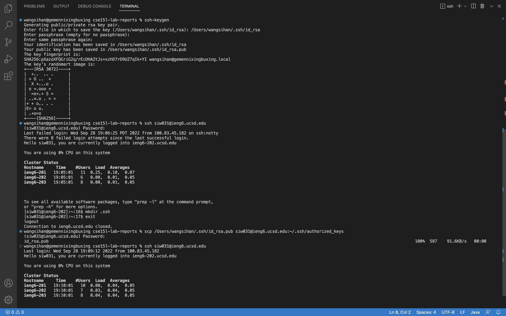
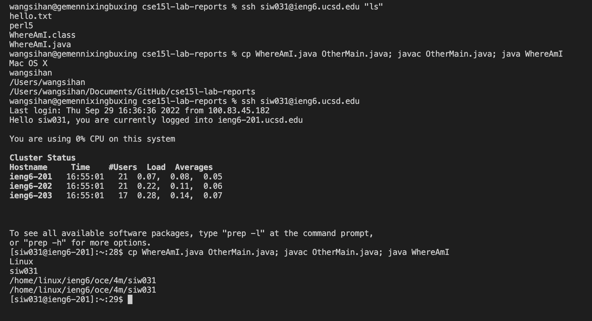

# Lab Report 2 Week 1

## Step 1: Installing VScode
* Go to the Visual Studio Code website: [Link](https://code.visualstudio.com/)
* following the instruction

* open a window look like this:



---

## Step 2: Remotely Connecting
* Install OpenSSH, which can connect your local computer to remote computers
* open a terminal in VSCode and type the following command:
`ssh cs15lfa22zz@ieng6.ucsd.edu` and enter the password
(Note: You should replace the `zz` with the letters in your own account.

* then can see the following messages:


That means you're successfully logged in to the remote server!

---

## Step 3: Trying Some Commands
* Try `cd`, `ls -a`, `cd ~`, `ls -lat`, `ls <directory>`, `cp /home/linux/ieng6/cs15lfa22/public/hello.txt ~/`, `cat /home/linux/ieng6/cs15lfa22/public/hello.txt`and etc.
* There are some explanations of those commands:
`ls -a` : list all files including hidden files and these are the files’ names beginning with a dot.

`cd` : change to the directory you want move to

`cat` : reads the contents of a file

And think about what other commands can do!
* After that, you can see like this:


These are some examples that you can see after trying those commands.
* Run the command `exit` to log out the remote server.

---

## Step 4: Moving Files with scp
* Create a java file named `WhereAmI.java` and copy and paste the following code:

```
class WhereAmI {
  public static void main(String[] args) {
    System.out.println(System.getProperty("os.name"));
    System.out.println(System.getProperty("user.name"));
    System.out.println(System.getProperty("user.home"));
    System.out.println(System.getProperty("user.dir"));
  }
}
```


* Run the commands below:

```
javac WhereAmI.java
java WhereAmI
```

* Run this command:`scp WhereAmI.java siw031@ieng6.ucsd.edu:~/`
* Log with ssh and run `javac WhereAmI.java` and `java WhereAmI` on the remote server

Then you can see something like this:



You can found that what we’ve done is almost identical with “getProperty”. When you run the commands on the client, you can see the information of operating system of your client. When you run this on the server, you can see the operating system of the remote server.

---

## Step 5: Setting an SSH Key
* Obeviously, we need to enter the password every time we log in or run scp, which is time-consuming.
Thus, we can set up an SSH key to solve that and no longer need to enter the password when log in or run scp.
* On client, run this command:`ssh-keygen` and following the commands on the following screenshot:



* Then you can log into the remote server without entering password. Hence, you can save a lot of time and also can avoid many mistakes when you enter the password.

---

## Step 6: Optimizing Remote Running
* Now we will learn some useful skills, which will let your work more efficient.
* We can use "" to write a command at the end of `ssh` command to directly run it, for example:

```
ssh siw031@ieng6.ucsd.edu "ls"
```

* We can apply semicolons to run multiple commands, for example:

```
cp WhereAmI.java OtherMain.java; javac OtherMain.java; java WhereAmI
```
* We can use up-arrow to recall commands

Smiliar to the following image:



Hence, try to apply them in your work, which can save lots of times and convinient for you.
