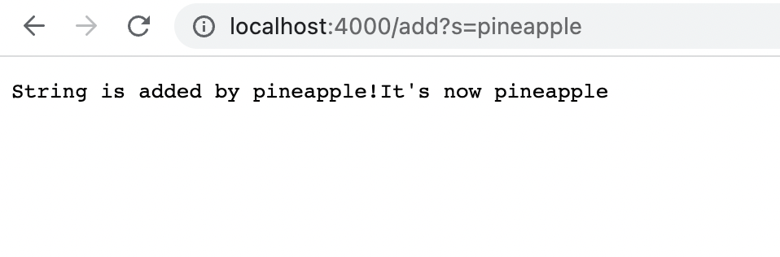
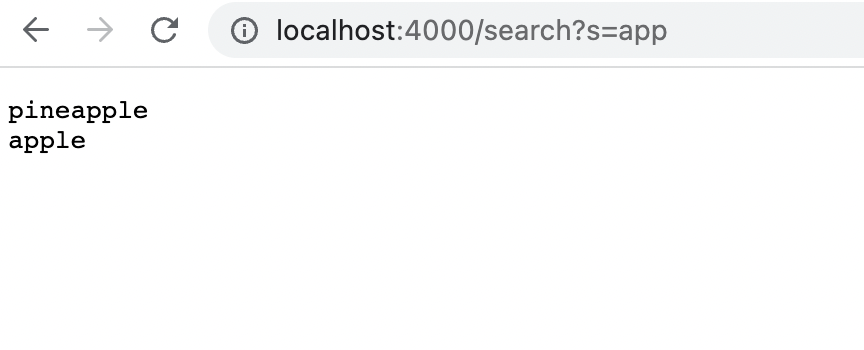
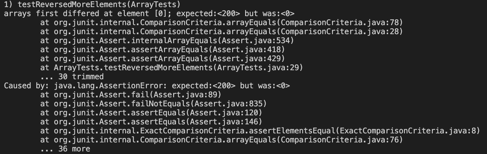
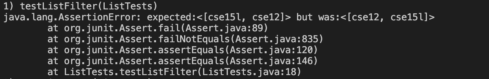

# Part 1
Here is the code for my Simplest Search Engine from week 2 :

```
import java.io.IOException;
import java.net.URI;

class Handler implements URLHandler {
    // The one bit of state on the server: a number that will be manipulated by
    // various requests.
    String str = "";

    public String handleRequest(URI url) {
        if (url.getPath().equals("/")) {
            return "String: " + str;
        } 
        else if (url.getPath().contains("/search")){
            System.out.println("Path: " + url.getPath());
            String[] parameters = url.getQuery().split("=");
            String searchResult = "";
            if (parameters[0].equals("s")) {
                String[] separateStr = str.split("\\\\n");
                for (String s: separateStr) {
                    if (s.contains(parameters[1])) {
                        searchResult = searchResult + s;
                    }
                }
            }
            return searchResult;
        }
        else {
            System.out.println("Path: " + url.getPath());
            if (url.getPath().contains("/add")) {
                String[] parameters = url.getQuery().split("=");
                if (parameters[0].equals("s")) {
                    str += parameters[1];
                    str += "\n";
                    return "String is added by " + parameters[1] + "!" + "It's now " + str;
                }
            }
            return "404 Not Found!";
        }
    }
}

class SearchEngine {
    public static void main(String[] args) throws IOException {
        if(args.length == 0){
            System.out.println("Missing port number! Try any number between 1024 to 49151");
            return;
        }

        int port = Integer.parseInt(args[0]);

        Server.start(port, new Handler());
    }
}
```
Here are three screenshots:
** 1. Add a string "pineapple"
- Here are some **methods are called**: `.handleRequest(url)`, `.getPath()`, `.contains(str)`, `.getQuery()`, `.split(str)`, and `.equal(str)`. The following are the explanations.
- First, I call handleRequest method in class Handler and take an argument url.
- Using .getPath() method to check whether the path contains only "/" or "/search" or "/add". In this case, the path, "/add?s=pineapple", only contains "/add".
- Then, it creates a string array called parameters, which stores the array by splitting the query with "=". In this case, parameters[0] = "s" and parameters[1] = "pineapple".
- When the parameters[0] is "s", I add the field **str** by parameters[1], which is "pineapple". And start a new line.
- Finally, return "String is added by " + parameters[1] + "!" + "It's now " + **str**.

This is the screenshot.


** 2. Search a string "app"
- Here are some **methods are called**: `.handleRequest(url)`, `.getPath()`, `.contains(str)`, `.getQuery()`, `.split(str)`, and `.equal(str)`. The following are the explanations.
- First, I call handleRequest method in class Handler and take an argument url.
- Using .getPath() method to check whether the path contains only "/" or "/search" or "/add". In this case, the path, "/search?s=app", only contains "/search".
- Then, I create a string array called parameters, which stores the array by splitting the query with "=". In this case, parameters[0] = "s" and parameters[1] = "app".
- Also, I create an empty string called **searchResult** to store the words contain "app".
- When the parameters[0] is "s", I split the current string with different lines and store them into a String array called separateStr.
- After that, I use a for loop to check each element of separateStr. I add it to **searchResult** if it contains "app".
- Finally, return **searchResult**.

This is the screenshot.


** 3. After adding strings, go back to root path
- Here are some **methods are called**: `.handleRequest(url)`, `.getPath()`, and `.equal(str)`. The following are the explanations.
- First, I call handleRequest method in class Handler and take an argument url.
- Using .getPath() method to check whether the path contains only "/" or "/search" or "/add". In this case, the path, "/", equals to "/".
- Just return the field str in type String.

This is the screenshot.

# Part 2
** 1. First bug appears on reversed method in ArrayExamples.java
- The failure-inducing input (the code of the test):

```
@Test
  public void testReversedMoreElements() {
    int[] input1 = {1, 2, 100, 200};
    assertArrayEquals(new int[]{200, 100, 2, 1}, ArrayExamples.reversed(input1));
  }
```
- The symptom (the failing test output):

- The bug (the code fix needed):

```
static int[] reversed(int[] arr) {
    int[] newArray = new int[arr.length];
    for(int i = 0; i < arr.length; i += 1) {
      arr[i] = newArray[arr.length - i - 1];
    }
    return arr;
  }
```
- The code after fixing:

```
static int[] reversed(int[] arr) {
    int[] newArray = new int[arr.length];
    int index = 0;
    for(int i = arr.length-1; i >= 0; i += -1) {
      newArray[index] = arr[i];
      index += 1;
    }
    return newArray;
  }
```
- The explanation of the connection between the symptom and the bug:
First, it creates a  new empty array. Then, it loops from the first integer to the last integer in input **arr**. The bug is the method assigns the values in newArray to arr.
However, the newArray is empty, so after looping, all of elements in arr will be 0. That's why the symptom said "arrays first differed at element [0]; expected:<200> but was:<0>."

** 2. The second bug appears on filter method in ListExamples.java
- The failure-inducing input (the code of the test):

```
@Test
  public void testListFilter() {
    List<String> input = new ArrayList<>();
    input.add("cse15l");
    input.add("cse12");
    input.add("doc1");
    List<String> list = new ArrayList<>();
    list.add("cse15l");
    list.add("cse12");
    StringChecker sc = new ListExamples();
    List<String> output = ListExamples.filter(input, sc);
    assertEquals(list, output);
```
- The symptom (the failing test output):

- The bug (the code fix needed):

```
static List<String> filter(List<String> list, StringChecker sc) {
    List<String> result = new ArrayList<>();
    for(String s: list) {
      if(sc.checkString(s)) {
        result.add(0, s);
      }
    }
    return result;
  }
```
- The code after fixing:
```
static List<String> filter(List<String> list, StringChecker sc) {
    List<String> result = new ArrayList<>();
    for(String s: list) {
      if(sc.checkString(s)) {
        result.add(s);
      }
    }
    return result;
  }
```
- The explanation of the connection between the symptom and the bug:
First, the method creates a new array String list called **result**. Then it loops from the first element to the last element in the input **list**. If the element fulfills the requirement of the method **checkString**, which is whether contains "cse", it will be added to **result** at index 0. Here is the bug because we want elements in the same order they appeared in the input list. However, the later elements that contain "cse" will come earlier. Thus, we should change `result.add(0, s)` to `result.add(s)`.
